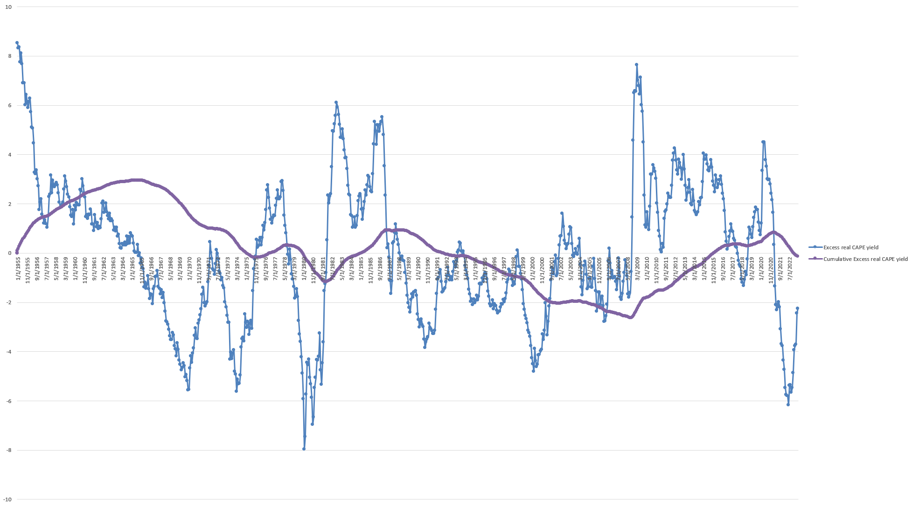

# real_shiller_cape_index

Based on formula:

Real excess cape yield = (weighted earnings of snp500 for year / market cap) - (10 year treasury yield) - (inflation)

### When using only data 1914-2023:

Sorted real excess cape yield (please ignore empty values on the right):

# Explanation

On average excess real return is estimated to be about 2.11% since 1914(this value is significantly impacted by
deflation in 1921, 1931, and 1949 as
significant outliers which increase average).

25th percentile: -1.47%

50th percentile: 1.03%

75th percentile: 3.63%

Average 10-90 percentiles: 1.36%

### So safe to say that returns of snp500 index mostly represent on average:

(!) treasury bonds yield + inflation + volatility premium (!)

### OR in real returns:

(!) treasury bonds yield + volatility premium (!)

Volatility premium is about 1.36%, but it is still relatively negligible.

Assumption is that earnings are almost entirely responsible for total return on average (e.g. via buybacks and
dividends).
This is not the case because of corporate taxes which can decrease total returns.

# Disclosure:

Before doing research I assumed that Real excess cape yield would be near 0%, and this was confirmed by my calculations.

As far as I understand that it is slightly above 0% because of:

- volatility
- tax incentives
- monetary policies
- random time period used for calculation (is it statistically significant? probably not.)

# Edit (extra):

### When using only data 1955-2023:

25th percentile: -1.9%

50th percentile: -0.09%

75th percentile: 1.94%

Average 10-90 percentiles: -0.071%

### When using only data 2009-2023:

25th percentile: -0.31%

50th percentile: 1.85%

75th percentile: 3.11%

Average 10-90 percentiles: 1.592%

# Conclusions:

Volatility premium might not exist at all, and it is probably just a statistical artifact.

If it did exist, it likely mostly stopped existing after 1955 for some reason.

It also possibly existed in 2009-2021.

If it exists, it is probably between 0% and 2%.

# Data was taken from:

https://www.gurufocus.com/economic_indicators/4530/shiller-excess-cape-yield-for-the-sp-500

https://www.gurufocus.com/economic_indicators/5728/us-inflation-rate

# Found any errors? Please let me know by opening an issue

Thanks
